  

 

## 01 · Profile

I\'m a **Computer Science Engineering student at BMS Institute of Technology and Management**, focused on **AI engineering and full-stack development**.

I build systems around **LLMs, agentic workflows, RAG / CRAG, retrieval, machine learning, backend systems, and real-time applications** — sitting at the intersection of **AI systems**, **software engineering**, and **real-world products**.

 

## 02 · What I Build

| Agentic AI | Retrieval | Full-Stack | Machine Learning |
|---|---|---|---|
| LLM Applications | RAG / CRAG | React | Prediction |
| Agentic Workflows | Hybrid Retrieval | Python · FastAPI | Feature Engineering |
| Tool Calling | Embeddings | Node.js | Explainability |
| Memory Systems | Vector Search | REST APIs | Risk Analysis |
| AI Automation | Reranking | Real-Time Systems | Decision Systems |

 

## 03 · Featured Projects

### 🧠 TARK AI — *Agentic AI Workspace & Personal OS*
A full-stack AI workspace combining conversational AI, research, coding, document understanding, memory, productivity, and real-world tool actions.

`React` `Python` `FastAPI` `PostgreSQL` `pgvector` `LangGraph` `MCP` `Docker`

- Multi-model LLM routing with RAG/CRAG, hybrid retrieval, embeddings, reranking, and persistent memory.
- Agentic workflows for research, coding, tool calling, project context, and real-time streaming.
- Productivity and repository workflows through Google Calendar, Tasks, Reminders, Goals, and GitHub MCP tools.

**[View TARK AI →](https://github.com/gpranit16/tark-ai)**

---

### 💬 Syncora — *AI-Powered Team Collaboration & Productivity Platform*
A full-stack collaboration platform combining real-time messaging, meetings, task management, WebRTC calling, and AI-powered meeting intelligence.

`React` `TypeScript` `Node.js` `Express` `MySQL` `Socket.io` `WebRTC` `NVIDIA Nemotron`

- Built real-time channels, direct messaging, Kanban task management, and audio/video meetings.
- Engineered JWT authentication, RBAC, REST APIs, Socket.io event streaming, and call signaling.
- AI meeting intelligence turns transcripts and chat history into summaries, decisions, blockers, and actionable tasks.

**[View Syncora →](https://github.com/gpranit16/syncora)**

---

### 📉 Churn Reaper — *Customer Retention & Churn Intelligence System*
An AI/ML decision system that moves from churn prediction and risk explanation to retention-offer evaluation and ROI analysis.

`Python` `React` `FastAPI` `XGBoost` `Scikit-Learn` `TreeSHAP` `NVIDIA Nemotron`

- Predicts customer churn risk and identifies high-risk accounts from behavioral and transactional data.
- Uses XGBoost classification, feature engineering, and TreeSHAP attribution to explain individual risk drivers.
- Evaluates retention strategies using customer lifetime value, expected profit at risk, and projected ROI.

 

## 04 · Technical Stack

**AI Systems** — `LangChain` `LangGraph` `OpenAI SDK` `RAG / CRAG` `Embeddings` `Vector Search`
**Backend & Data** — `FastAPI` `Node.js` `Express.js` `PostgreSQL` `MongoDB` `pgvector` `REST APIs`
**Infrastructure & Tools** — `Docker` `Git & GitHub` `Vercel` `Render` `Postman`

 

## 05 · Experience

**Full-Stack Development Intern** · VeloxCodeAgency · June 2026
Worked across full-stack development workflows involving implementation, debugging, feature development, and delivery.
[View Certificate →](https://drive.google.com/file/d/1MJuRGNHNQLjjpQ9AkhTeTl3RlBvZgKb6/view?usp=sharing)

**Full Stack Developer (Intern)** · SuccessPath Classes · Jan 2026 – Feb 2026
Contributed to full-stack development workflows across feature implementation, debugging, and deployment.
[View Certificate →](https://drive.google.com/file/d/193ISjwIzy7bkkUmtbc-QTjghxW0ASUvi/view?usp=sharing)

 

## 06 · Education

**B.E. in Computer Science Engineering**
BMS Institute of Technology and Management, Bengaluru · CGPA 8.72 · 2024–2028

 

## 07 · Achievements

🏆 **Best Innovation** — Agentic AI Sprint Workshop + Hackathon, GenAI Club, BMSIT&M
🥉 **3rd Place** — National-Level Sustainathon (₹10,000 prize)

 

## 08 · GitHub Stats

 

<strong>BUILD · SHIP · IMPROVE · REPEAT.</strong>

